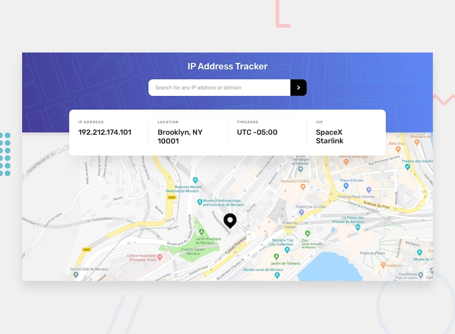
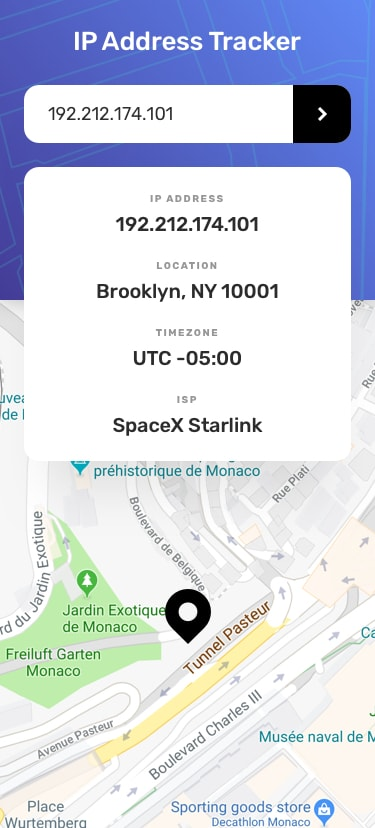

# IP Address Tracker

A web app that tracks the geolocation of an IP address or domain name, displaying the results on an interactive map. Built with TypeScript and Leaflet, powered by the [ipify Geolocation API](https://geo.ipify.org/).

## 🔗 Live Demo

[View the live site](https://verdant-alfajores-791364.netlify.app/)

## 📸 Preview



<details>
<summary>More screenshots</summary>

**Mobile**



**Desktop**


**Active states**


</details>

## 📸 Features

- Look up geolocation data by **IPv4 address**, **IPv6 address**, or **domain name**
- Client-side input validation with inline error messaging
- Interactive map (Leaflet + OpenStreetMap tiles) that pans/zooms to the searched location
- Displays IP address, location, timezone, and ISP details
- Automatically loads the user's own IP location on first visit

## 🛠️ Built With

- [TypeScript](https://www.typescriptlang.org/)
- [Leaflet](https://leafletjs.com/) for interactive maps
- [OpenStreetMap](https://www.openstreetmap.org/) tile layer
- [ipify Geolocation API](https://geo.ipify.org/) for IP/domain lookups
- Vite (or your bundler of choice) for local development and builds

## 📁 Project Structure

```
├── models/
│   └── ip_model.ts        # TypeScript interfaces for the API response
├── services/
│   └── apiResponse.ts     # Fetch logic for the ipify API
├── main.ts                 # App entry point: DOM logic, form handling, map rendering
└── index.html
```

## 🚀 Getting Started

### Prerequisites

- [Node.js](https://nodejs.org/) installed locally

### Installation

1. Clone the repository
   ```bash
   git clone https://github.com/Farrukh-Murtaza/ip-address-tracker.git
   cd ip-address-tracker
   ```
2. Install dependencies
   ```bash
   npm install
   ```
3. Add your ipify API key as an environment variable (see [Configuration](#-configuration) below)
4. Run the dev server
   ```bash
   npm run dev
   ```

## ⚙️ Configuration

This project requires an API key from [ipify](https://geo.ipify.org/). Create a `.env` file in the project root:

```
VITE_IPIFY_API_KEY=your_api_key_here
```


> ⚠️ Never commit your real API key to version control. Make sure `.env` is listed in `.gitignore`.

## 🧠 Development Reflection

Building this IP Address Tracker was a good exercise in tying together an external API, a mapping library, and TypeScript's type system into a small, functional tool. The core flow fetch geolocation data from ipify, then render it both as text and as a marker on a Leaflet map seemed simple at the outset, but a few details required real thought.

One challenge was input validation. Distinguishing IPv4, IPv6, and domain names with regex is deceptively tricky (the IPv6 pattern here is intentionally permissive rather than fully RFC-compliant), so I opted for "good enough" client-side validation and let the API be the final source of truth on whether a lookup succeeds.

Another challenge was state management around the Leaflet map instance. Since the map can't be initialized twice, I had to carefully branch between "create the map" (on first load) and "just update the view and marker" (on every subsequent search), which meant lifting `map` to module scope and checking for its existence before each operation.

Typing the API response with `IpApiResponse` paid off quickly — it caught a bug where `isp` was being set with inverted logic (`data.isp !== '' ? 'N/A' : data.isp`), a fix I plan to make going forward.

If I continued improving this project, I'd prioritize:
- Moving the API key out of source code and into an environment variable — right now it's hardcoded, which is a security risk worth fixing before sharing the repo publicly.
- Adding a loading state and friendlier error messaging instead of console-only failures.
- Debouncing input and adding unit tests around the validation regex and marker update logic.

Overall, this project reinforced how much small architectural decisions — like where state lives — shape the maintainability of even a small app.
